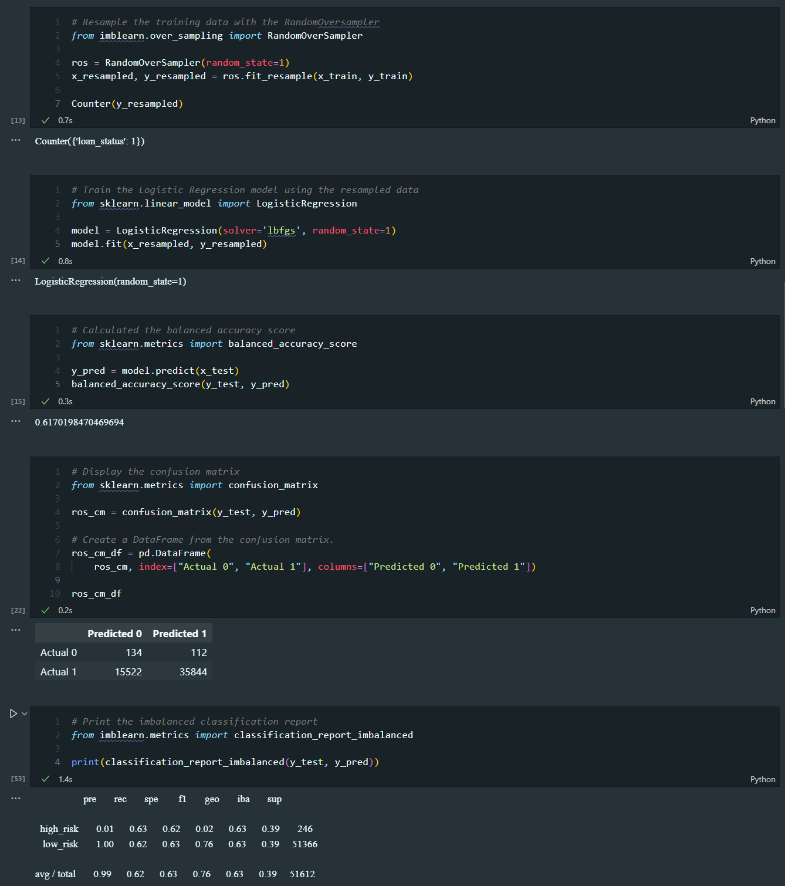
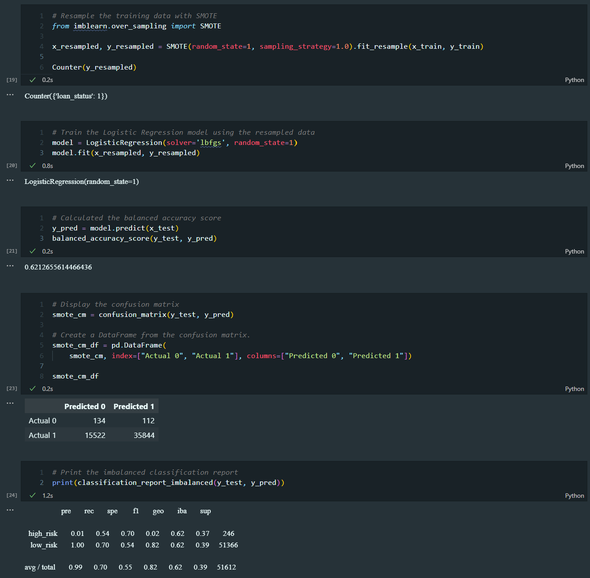
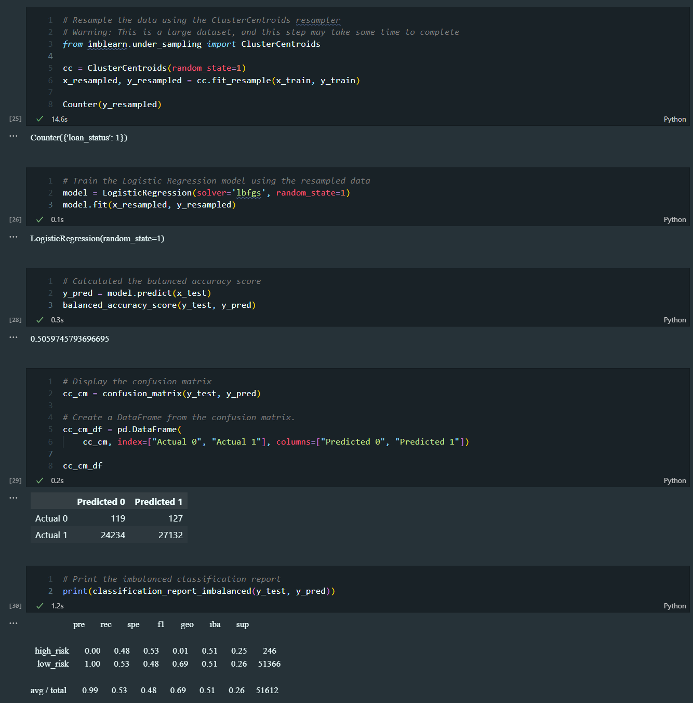
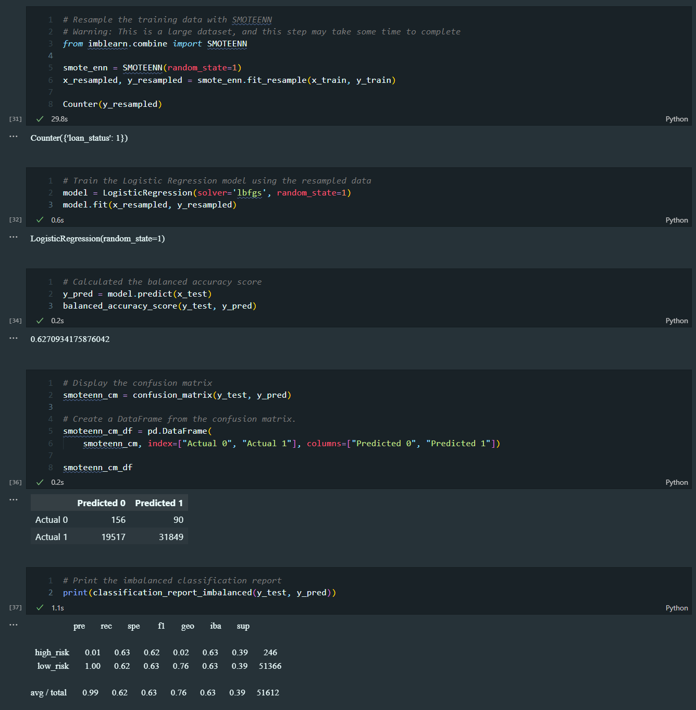
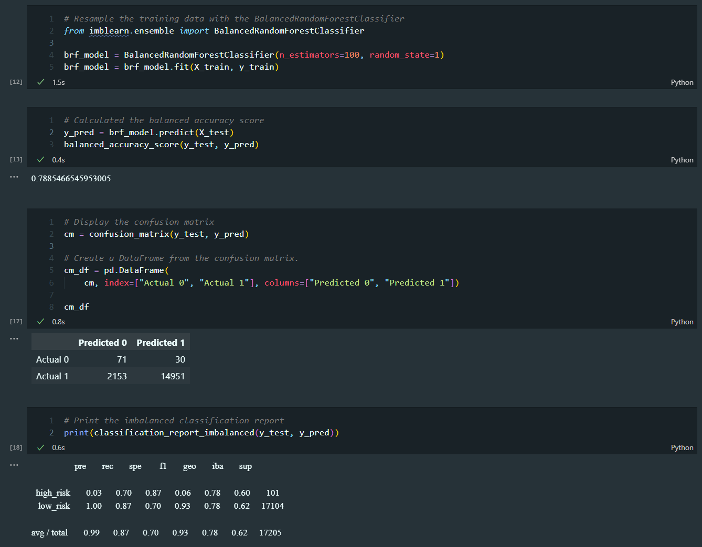
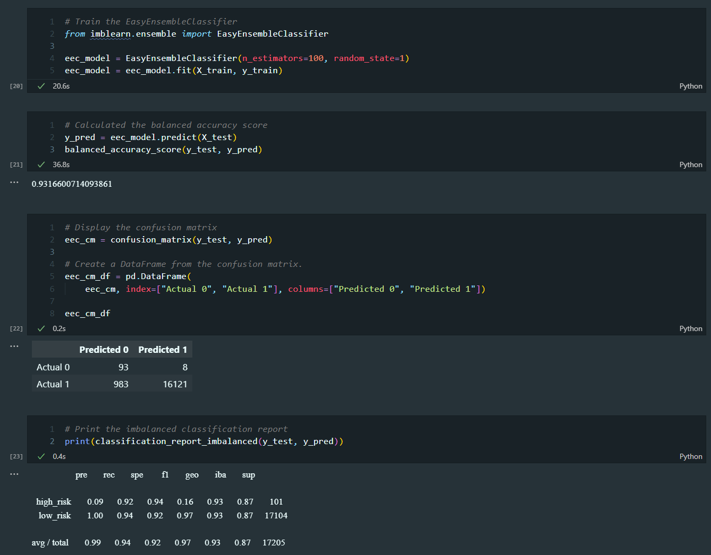

# Credit Risk Analysis

# Overview
The purpose of this project is to use machine learning and a variety of algorithms to predict credit risk. The data used is from LendingClub, a peer-to-peer lending services company. The data is imbalanced, with a vast majority of the data being low risk. The data is cleaned and then split into training and testing data. The data is then run through a variety of algorithms to determine which is the most accurate. The algorithms used are: RandomOverSampler, SMOTE, ClusterCentroids, SMOTEENN, BalancedRandomForestClassifier, EasyEnsembleClassifier.

# Results
### Naive Random Oversampling

    
Click to expand image

- The balanced accuracy score is 61.7%
- The precision for high risk is 1%
- The recall for high risk is 63%
- The precision for low risk is 100%
- The recall for low risk is 62%

### SMOTE Oversampling

    
Click to expand image

- The balanced accuracy score is 62.1%
- The precision for high risk is 1%
- The recall for high risk is 54%
- The precision for low risk is 100%
- The recall for low risk is 70%

### Undersampling: Cluster Centroids

    
Click to expand image

- The balanced accuracy score is 50.6%
- The precision for high risk is 0%
- The recall for high risk is 48%
- The precision for low risk is 100%
- The recall for low risk is 53%

### Combination Sampling: SMOTEENN

    
Click to expand image

- The balanced accuracy score is 62.7%
- The precision for high risk is 1%
- The recall for high risk is 63%
- The precision for low risk is 100%
- The recall for low risk is 62%

### Balanced Random Forest Classifier

    
Click to expand image

- The balanced accuracy score is 78.8%
- The precision for high risk is 3%
- The recall for high risk is 70%
- The precision for low risk is 100%
- The recall for low risk is 87%

### Easy Ensemble AdaBoost Classifier

    
Click to expand image

- The balanced accuracy score is 93.2%
- The precision for high risk is 9%
- The recall for high risk is 92%
- The precision for low risk is 100%
- The recall for low risk is 94%

# Summary